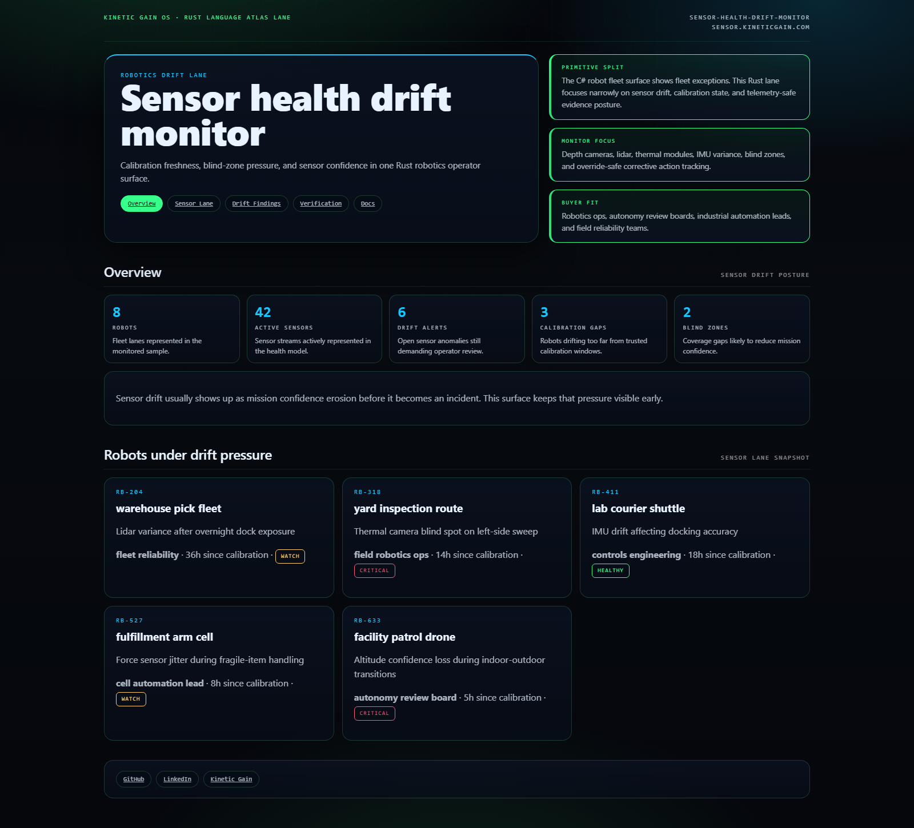
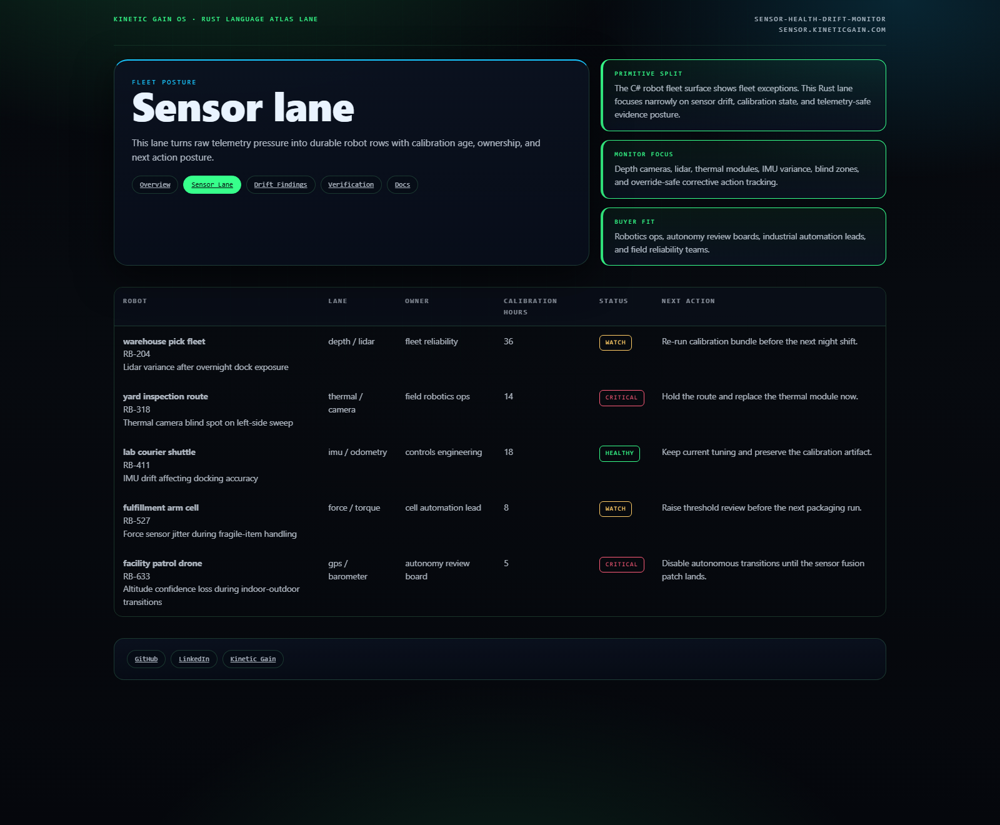
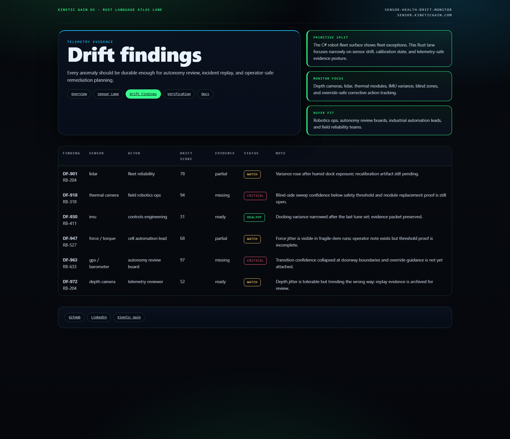
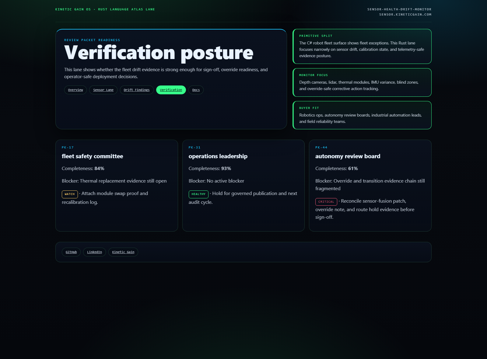

# Sensor Health Drift Monitor

[](https://github.com/mizcausevic-dev/sensor-health-drift-monitor/actions/workflows/ci.yml)
[](./LICENSE)
[](https://github.com/mizcausevic-dev/sensor-health-drift-monitor/actions/workflows/pages.yml)

Rust operator surface for robot-fleet sensor drift, calibration freshness, blind-zone pressure, telemetry health, and override-safe remediation posture.

## Why this exists

- Robot fleets do not fail all at once. They drift one sensor lane at a time: stale calibrations, noisy depth cameras, thermal blind spots, and IMU variance that quietly degrade mission safety.
- Ops teams need one review-safe surface that shows which robots are drifting, which sensor stack is unstable, who owns the fix, and whether the fleet is still safe to run.
- Trustworthy robotics programs need more than raw telemetry. They need operator-readable posture, escalation-safe summaries, and evidence that corrective actions were actually taken.

## Why this matters (KG Embedded tie-back)

This repo demonstrates the robotics observability primitive for industrial autonomy buyers: drift scoring, blind-zone evidence, calibration freshness, and override-safe remediation in one Rust operator surface. Kinetic Gain Embedded extends this into in-product telemetry posture, fleet reliability review, and operator-safe incident escalation, see [kineticgain.com/embedded](https://kineticgain.com/embedded).

## Routes

- `/`
- `/sensor-lane`
- `/drift-findings`
- `/verification`
- `/docs`

## API

- `/api/dashboard/summary`
- `/api/sensor-lane`
- `/api/drift-findings`
- `/api/verification`
- `/api/sample`

## Screenshots






## Local development

```powershell
cd sensor-health-drift-monitor
cargo run
```

Open:
- [http://127.0.0.1:5532/](http://127.0.0.1:5532/)
- [http://127.0.0.1:5532/sensor-lane](http://127.0.0.1:5532/sensor-lane)
- [http://127.0.0.1:5532/drift-findings](http://127.0.0.1:5532/drift-findings)
- [http://127.0.0.1:5532/verification](http://127.0.0.1:5532/verification)

## Validation

- `cargo test`
- `cargo build`
- `cargo run --bin prerender`
- `cargo run --bin demo`
- `cargo run --bin smoke`
- `powershell -ExecutionPolicy Bypass -File .\scripts\render_readme_assets.ps1`

## Production status

| Aspect | Status |
|--------|--------|
| CI | Rust build · tests · prerender · demo · smoke ([workflow](./.github/workflows/ci.yml)) |
| Test coverage | Example core coverage with expansion path for telemetry parsers and fleet reducers |
| License | [AGPL-3.0-or-later](./LICENSE) |
| Security | [SECURITY.md](./SECURITY.md) |
| Deploy | Static prerender → **https://sensor.kineticgain.com/** (GitHub Pages, [pages workflow](./.github/workflows/pages.yml)) |

## Docs

- [Architecture](./docs/architecture.md)
- [Origin](./docs/ORIGIN.md)
- [Kinetic Gain Embedded tie-back](./docs/KINETIC_GAIN_EMBEDDED.md)
- [Changelog](./CHANGELOG.md)

## Part of the Kinetic Gain Suite

Operator surface in the [Kinetic Gain Suite](https://suite.kineticgain.com/) — a portfolio of buyer-readable control planes spanning robotics, biotech, FinTech, cloud governance, and operator workflows. See the suite index for related surfaces. Apex: [kineticgain.com](https://kineticgain.com/).
